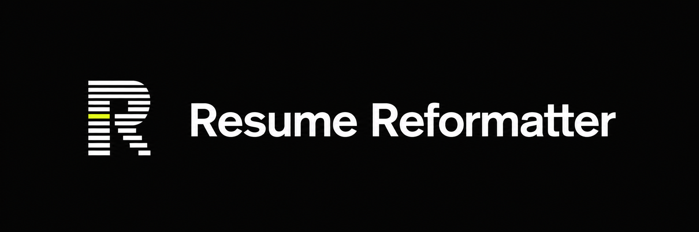
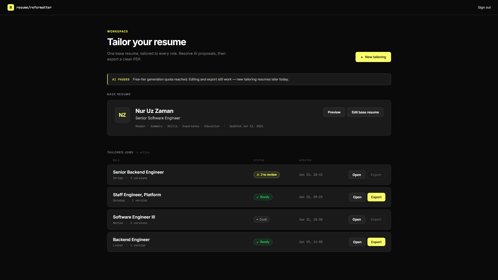
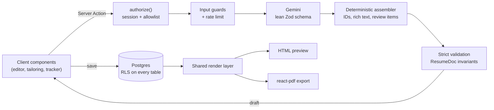

# Resume Reformatter



An AI resume tailoring app. Import a base resume (pasted text or PDF), paste a job
description, and get a tailored draft where every AI-introduced claim has to be accepted or
dismissed before the resume can be exported as a PDF. Tailored resumes double as job
applications with a small pipeline tracker.



## Features

- **Resume import:** Gemini parses pasted text or an uploaded PDF into a structured resume
  document.
- **Tailoring with claim review:** the model rewrites content for a target role. Anything it
  can't trace back to the base resume is flagged as a proposal that you accept or dismiss.
  Export stays blocked until every proposal is resolved.
- **Block editor:** reorder, hide, and edit sections with Tiptap rich-text fields, next to a
  live preview.
- **PDF export:** generated in the browser with `@react-pdf/renderer`, from the same document
  model and typography tokens as the HTML preview.
- **Job tracker:** stages, applied and follow-up dates, posting link, notes, and a stage
  timeline for each tailored resume.
- **Invite-only access:** email + password sign-in gated by a Postgres allowlist, with
  per-user and per-IP generation rate limits.

## Tech stack

| Area | Choice |
| --- | --- |
| Framework | Next.js 16 (App Router, Server Actions), React 19, TypeScript |
| Styling | Tailwind CSS v4 with CSS `@theme` tokens |
| Data & auth | Supabase (Postgres, Auth, Row Level Security) |
| AI | Vercel AI SDK + Google Gemini, structured output validated with Zod |
| Editor | Tiptap 3 |
| PDF | `@react-pdf/renderer` with embedded Source Serif 4 |
| Testing | Vitest (unit + renderer snapshots), pgTAP (RLS policies) |

## Architecture



- **One canonical document.** A resume is a versioned JSON document (`lib/resume/schema.ts`)
  with a migration path and cross-field invariant checks. The editor, HTML preview, and PDF
  renderer all consume the same model through `lib/render`.
- **Two-layer AI output.** The model fills a deliberately small schema. A deterministic
  assembler turns that into the full document (stable IDs, rich text, pinned header, review
  items). Model output never reaches the database without passing strict validation, and a
  schema failure gets one retry with the validation errors fed back to the model.
- **Nothing is persisted from AI output directly.** Parsing and tailoring return drafts. The
  user reviews them and saves explicitly.
- **Defense in depth.** The proxy only refreshes sessions and redirects. Authorization happens
  in `lib/auth/guards.ts` on every server action and page, and Postgres RLS policies (checking
  ownership plus current allowlist membership) are the final boundary. Queries are also
  scoped by `user_id`.
- **Rate limiting in Postgres.** A fixed-window counter behind a `security definer` function,
  so limits hold across serverless instances without extra infrastructure.

### Project layout

```
app/
  (auth)/            sign-in
  (app)/             protected routes: dashboard, editor, tailor, preview, tracker
  auth/confirm/      Supabase email-link callback
components/          UI by feature (editor, preview, dashboard, tracker, landing, ui)
lib/
  resume/            document model: schema, validation, migrations, CRUD actions, queries
  parsing/           resume import: prompt, model call, schema, assembler, action
  tailoring/         tailoring: prompt, model call, schema, assembler, action
  applications/      application stages, timeline, stats, update action
  editor/            editor state reducer and selectors
  render/            shared HTML/PDF rendering primitives and tokens
  ai/                model config, error classification, generation settings, logging
  auth/              guards, allowlist, auth actions
  ratelimit/         Postgres-backed rate limiting
  supabase/          server, browser, and admin clients
supabase/
  migrations/        schema, RLS policies, functions
  tests/             pgTAP RLS tests
proxy.ts             session refresh and UX redirects
```

## Getting started

Requirements: Node 20+, a Supabase project, and a Google Gemini API key.

1. Install dependencies:

   ```bash
   npm install
   ```

2. Set up the database by following [`supabase/README.md`](./supabase/README.md) (migrations,
   allowlist seed, auth settings).

3. Configure the environment:

   ```bash
   cp .env.example .env.local
   ```

   | Variable | Scope | Purpose |
   | --- | --- | --- |
   | `NEXT_PUBLIC_SUPABASE_URL` | public | Supabase project URL |
   | `NEXT_PUBLIC_SUPABASE_PUBLISHABLE_KEY` | public | Supabase publishable key |
   | `SUPABASE_SECRET_KEY` | server | Admin key for allowlist checks and account creation |
   | `SITE_URL` | server | Canonical origin for auth redirects |
   | `AI_MODEL_ID` | server | Gemini model id, e.g. `gemini-3.1-flash-lite` |
   | `GOOGLE_GENERATIVE_AI_API_KEY` | server | Gemini API key |

4. Start the dev server:

   ```bash
   npm run dev
   ```

   Open http://localhost:3000 and sign in with an email that's in the `allowed_emails` table.

## Scripts

| Command | Description |
| --- | --- |
| `npm run dev` | Start the dev server |
| `npm run build` | Production build |
| `npm run start` | Serve the production build |
| `npm run lint` | ESLint |
| `npm run typecheck` | TypeScript, no emit |
| `npm test` | Vitest unit and snapshot tests |
| `npm run db:push` | Apply migrations to the linked Supabase project |

RLS tests run with pgTAP against a Supabase Postgres database. See
[`supabase/README.md`](./supabase/README.md).
