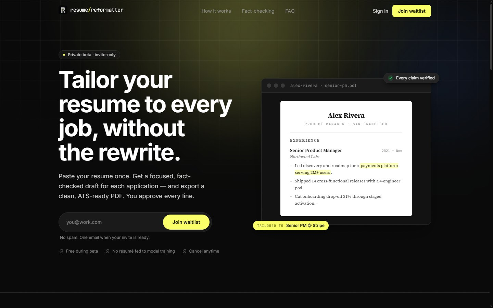
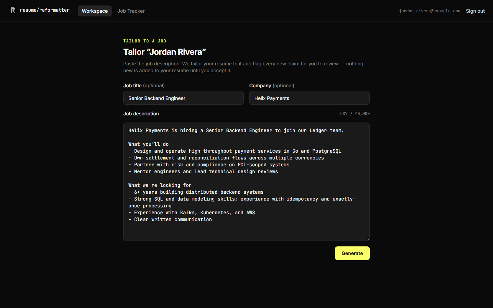
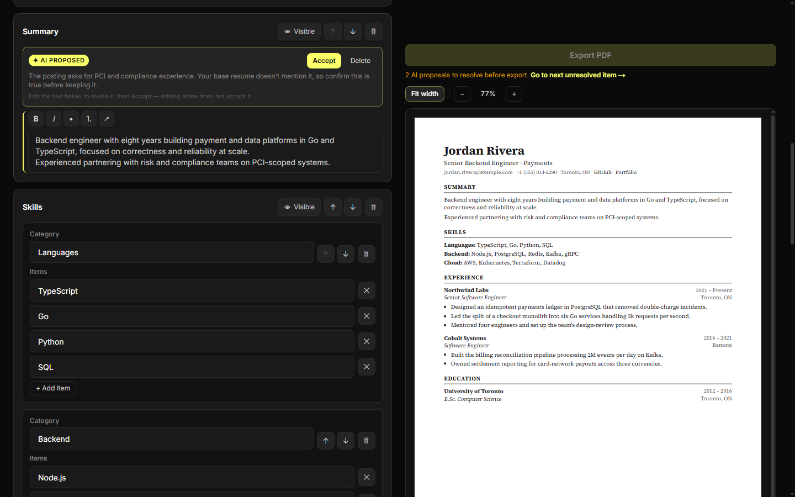
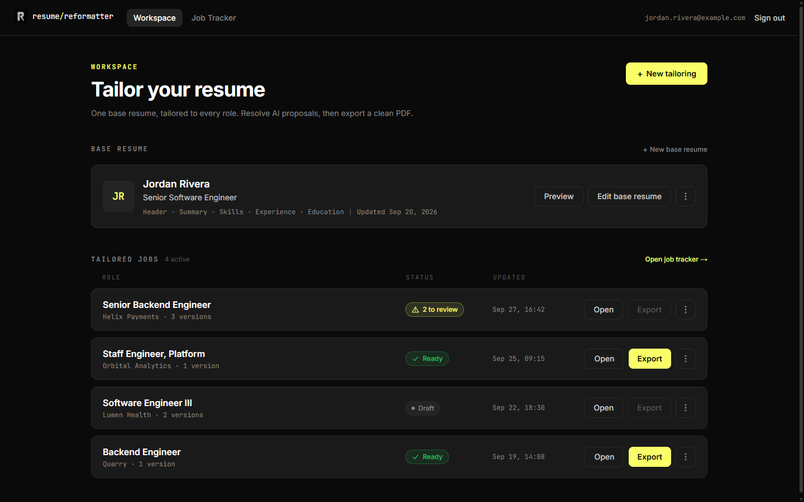
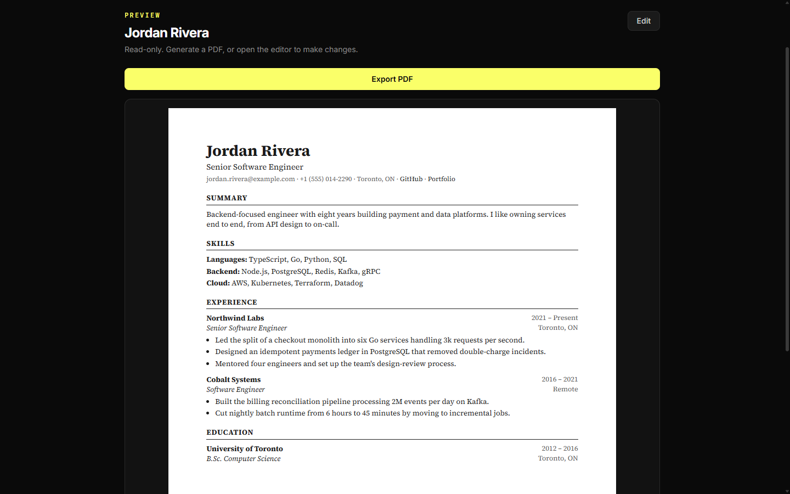
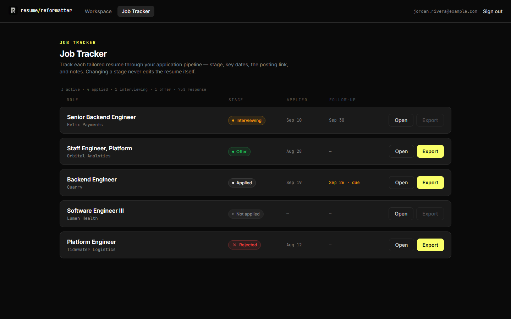
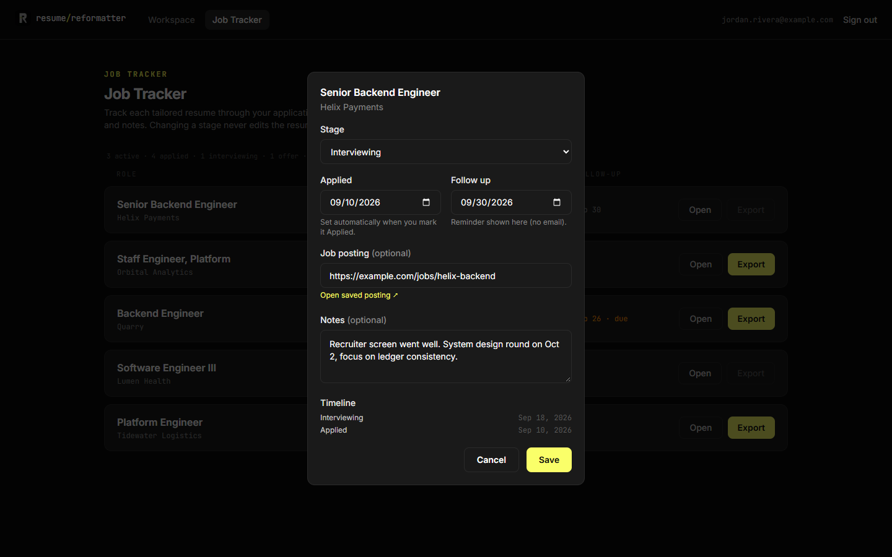

# Resume Reformatter

**Tailor your resume to every job, without the rewrite.**

Paste a job description, get a tailored draft, and approve every AI-written claim before
exporting a clean PDF.

https://github.com/user-attachments/assets/ea5712bb-cbaf-4638-8cda-d1376605f94f

<!--  -->

## Features

### Tailor to any role

Pick a base resume, paste the job description, and generate a draft rewritten for that role.
Job title and company are inferred when you leave them blank.

### Review every AI claim

Content the model can't trace back to your base resume is flagged as a proposal with an
explanation. Accept, edit, or delete each one. Export stays locked until nothing is pending.

### One workspace for every version

Keep your base resume alongside every tailored version, each with its review status.

### Print-ready PDF

The HTML preview and the PDF export render the same document model with the same
typography, so what you see is what you send.

### Track your applications

Each tailored resume doubles as an application with a stage, applied and follow-up dates,
the posting link, notes, and a timeline.

<table>
  <tr>
    <td width="50%"></td>
    <td width="50%"></td>
  </tr>
</table>
